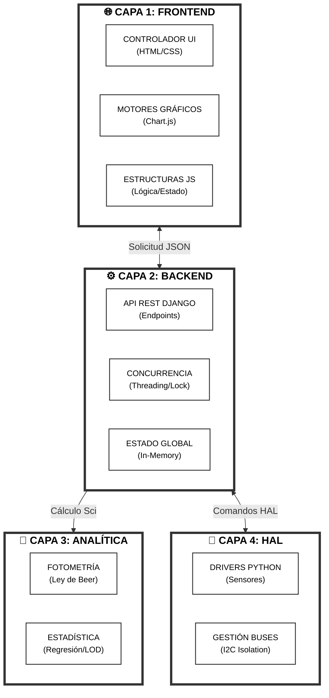
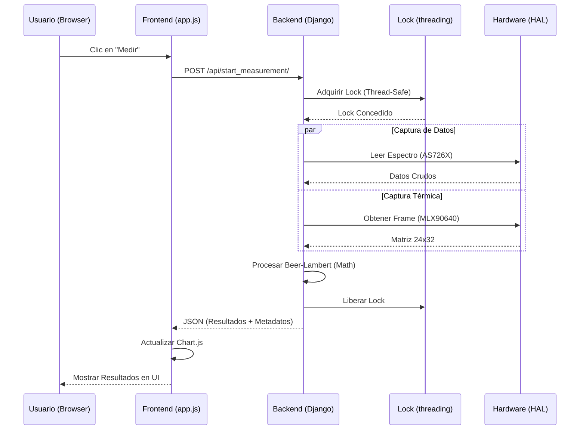

<!--
  Copyright (c) 2026 Sebastian Herrera Betancur
  Biomicrosystems Research Group | Universidad de los Andes
  PROPRIETARY CODE - Unauthorized use, copying or distribution is strictly prohibited.
-->

# Arquitectura Detallada del Sistema

Este documento describe la arquitectura técnica y el flujo de datos del espectrofotómetro basado en Raspberry Pi, detallando las tecnologías y la implementación de cada capa.

## 1. Diagrama de Arquitectura (High-Level)

---

## 2. Detalle de Componentes y Tecnologías

### 🔵 Capa de Cliente (Frontend)
Diseñada como una **Single Page Application (SPA)** reactiva pero ligera.
-   **JavaScript (ES6+):** Utiliza una arquitectura basada en un objeto `appState` global que sincroniza el estado de la UI con el backend.
-   **Vanilla CSS:** Estilizado con variables CSS para soportar **Modo Oscuro/Claro** dinámico y Glassmorphism.
-   **Chart.js + Hammer.js:** Visualización avanzada con soporte para zoom táctil y pan en tiempo real.
-   **Sistema de Traducción:** Carga asíncrona de `es.json` y `en.json` para internacionalización total sin recargar la página.

### 🟣 Capa de Servidor (Backend)
Construida sobre **Django**, enfocada en la seguridad y el procesamiento matemático.
-   **REST API:** Endpoints JSON para control de hardware, cálculos de concentración y exportación de datos.
-   **Thread-Safe State:** Implementación de un diccionario `_state` protegido por `threading.Lock`. Esto permite que múltiples peticiones (ej. captura térmica y medición espectral) no corrompan los datos.
-   **Motor Estadístico:** Utiliza **NumPy** y **SciPy** para realizar:
    -   Regresiones lineales y no lineales (Mínimos Cuadrados Ordinarios).
    -   Pruebas de normalidad (Shapiro-Wilk).
    -   Inferencia estadística (t-Student).

### 🟢 Capa de Hardware (HAL)
Abstracción total de los sensores físicos.
-   **Dual I2C Bus:** Configuración específica para Raspberry Pi que separa la cámara térmica (bus 1) del espectrofotómetro (bus 22) para evitar colisiones de ancho de banda.
-   **MLX90640 (Térmica):** Hilo de ejecución independiente (background thread) para la adquisición constante de frames a 2Hz/4Hz sin bloquear la aplicación.
-   **Mocks/Emuladores:** Sistema de detección de plataforma que activa emuladores de hardware en entornos de desarrollo (Windows/macOS), inyectando ruido gaussiano realista.

---

## 3. Flujo de Datos Crítico (Medición)

### 🔄 Diagrama de Secuencia: Flujo de Medición

1.  **Solicitud:** El usuario presiona "Medir" en el Frontend.
2.  **API Call:** `app.js` envía un `POST` a `/api/start_measurement/`.
3.  **Hardware Sync:** El backend adquiere el espectro del AS726X y, simultáneamente, extrae el último frame del buffer de la cámara térmica.
4.  **Procesamiento:** Se aplica la **Ley de Beer-Lambert** usando la referencia de blanco ($I_0$) guardada en el estado.
5.  **Persistencia:** Los datos se guardan en el historial en memoria y se devuelven al cliente en formato JSON.
6.  **Renderizado:** `Chart.js` actualiza las gráficas y la tabla de historial se refresca mediante manipulación del DOM eficiente.

---

## 4. Tecnologías Clave Utilizadas

| Categoría | Tecnología | Uso Principal |
| :--- | :--- | :--- |
| **Lenguaje** | Python 3.10+ | Lógica de servidor y control de hardware. |
| **Web Framework** | Django | API REST y gestión de sesiones. |
| **Matemáticas** | NumPy / SciPy | Procesamiento analítico y regresiones. |
| **Hardware** | SMBus2 / Adafruit | Comunicación I2C y control de sensores. |
| **Visualización** | Chart.js 4.x | Gráficas interactivas de espectro y curvas. |
| **Estilos** | Vanilla CSS | UI moderna, responsive y dark-mode. |
