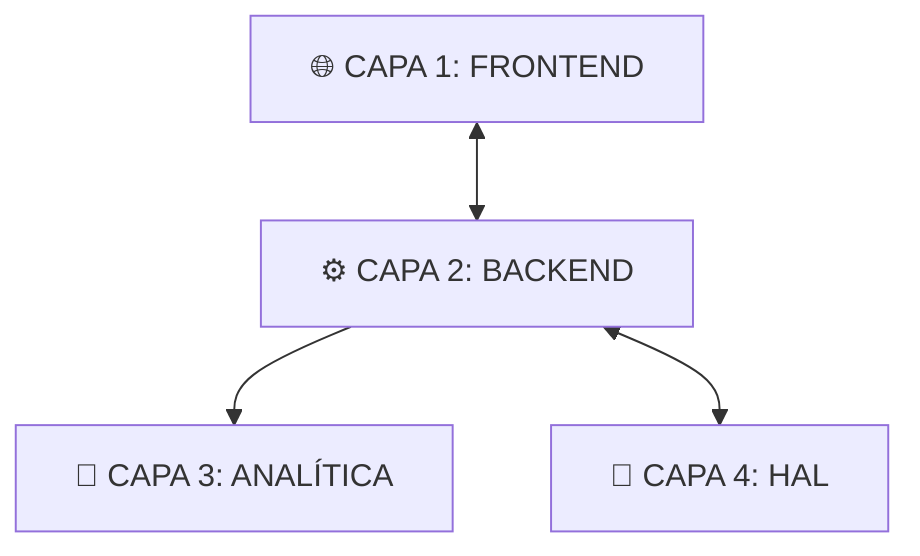

<!--
  Copyright (c) 2026 Sebastian Herrera Betancur
  Biomicrosystems Research Group | Universidad de los Andes
  PROPRIETARY CODE - Unauthorized use, copying or distribution is strictly prohibited.
-->

# Documentación Técnica: Arquitectura y Tecnologías del Proyecto Espectrofotómetro Web

Este documento detalla la arquitectura integral, las tecnologías subyacentes y la lógica de construcción del sistema de espectrofotometría basado en la integración de hardware (Raspberry Pi, sensores I2C) y una interfaz de control web (Django, SPA).

---

## Diagrama de Arquitectura de Alto Nivel

---

## 1. Descripción General del Proyecto

La plataforma es una solución de **espectrofotometría de bajo costo** y **termografía integrada**, diseñada para operar como una consola de laboratorio controlada vía navegador. Permite la captura de espectros visibles (6 canales), el monitoreo térmico en tiempo real (matriz de 768 píxeles) y el procesamiento estadístico avanzado de nivel analítico.

**Objetivo Central:** Democratizar el acceso a instrumentación analítica robusta mediante el uso de hardware comercial (off-the-shelf) y software de código abierto.

---

## 2. Arquitectura de Hardware (Capa Física)

El sistema se ejecuta sobre una **Raspberry Pi**, que actúa como el cerebro del instrumento y servidor de red.

### Sensores e Interfaz
1.  **Espectrofotómetro AS726X (AMS):**
    *   **Canales:** 6 longitudes de onda en el espectro visible (450nm, 500nm, 550nm, 570nm, 600nm, 650nm).
    *   **Comunicación:** Bus I2C-22 (emulado por software en GPIO 23/24) para evitar colisiones y mejorar la integridad de la señal.
    *   **Función:** Captura de intensidad luminosa y cálculo de absorbancia.
2.  **Cámara Térmica MLX90640 (Melexis):**
    *   **Resolución:** Arreglo focal de 24×32 píxeles (768 puntos de temperatura).
    *   **Comunicación:** Bus I2C-1 (estándar de Raspberry Pi en GPIO 2/3).
    *   **Función:** Monitoreo de isotermas en cubetas y correlación térmica de la cinética química.
3.  **Iluminación Activa:**
    *   **LED Externo:** Controlado mediante **GPIO 17**. El software sincroniza el encendido/apagado del LED con las tomas de referencia ($I_0$) y medición.

### Esquema de Pines (Raspberry Pi)
| Componente | Pin SDA | Pin SCL | Bus I2C | Alimentación |
| :--- | :--- | :--- | :--- | :--- |
| MLX90640 | GPIO 2 | GPIO 3 | Bus 1 | 3.3V |
| AS726X | GPIO 23 | GPIO 24 | Bus 22 | 3.3V |
| LED Control | GPIO 17 (Data) | - | - | 5V/3.3V |

---

## 3. Arquitectura del Backend (Capa de Lógica)

El servidor está construido sobre **Django 6.0**, utilizando un patrón de diseño orientado a servicios para el hardware.

### Tecnologías Core
*   **Lenguaje:** Python 3.x.
*   **Framework Web:** Django (WSGI).
*   **Motor Estadístico:** 
    *   `NumPy`: Procesamiento matricial de espectros.
    *   `SciPy`: Regresión lineal avanzada (`linregress`), pruebas de normalidad (`shapiro`) y pruebas de hipótesis (`ttest`).
*   **Gestión de Hardware:**
    *   `smbus2`: Comunicación de bajo nivel con el AS726X.
    *   `adafruit-circuitpython-mlx90640`: Driver para la matriz térmica.
    *   `RPi.GPIO`: Control de la línea de iluminación.

### Modelo de Estado (Single Instrument Model)
A diferencia de aplicaciones web tradicionales multi-usuario, este sistema implementa un **Estado Global Protegido** (`_state` en `views.py` mediante `threading.Lock`).
*   **Razón:** El servidor controla un único instrumento físico. Múltiples peticiones HTTP acceden al mismo hardware, por lo que se requiere una gestión centralizada de la sesión experimental (calibraciones activas, muestras acumuladas, etc.).
*   **Abstracción de Hardware:** El archivo `hardware.py` implementa el patrón **Singleton**. Si el sistema se detecta en Windows, carga automáticamente **Emuladores (Mocks)** que generan datos sintéticos, permitiendo el desarrollo y la enseñanza sin necesidad de hardware real.

---

## 4. Arquitectura del Frontend (Capa de Usuario)

La interfaz es una **Single Page Application (SPA)** diseñada para la visualización fluida de datos de alta frecuencia.

### Tecnologías Core
*   **Lenguaje:** JavaScript Vanilla (ES6+). No se utilizan frameworks pesados (React/Vue) para garantizar latencia mínima en Raspberry Pi.
*   **Visualización:** `Chart.js` con plugins de zoom y fondos personalizados.
*   **Estética:** CSS3 puro con variables dinámicas para **Modo Oscuro/Claro** de alta fidelidad.
*   **Internacionalización (i18n):** Sistema dinámico basado en archivos JSON (`en.json`, `es.json`). Permite cambiar el idioma de toda la interfaz (incluyendo manuales de ayuda) sin recargar la página.

### Comunicación
*   **API REST-like:** El frontend se comunica con Django mediante `fetch()` asíncrono y JSON.
*   **Seguridad:** Integración de tokens CSRF para todas las operaciones de control (Post-Connect, Start-Measurement).
*   **Polling Térmico:** El cliente solicita actualizaciones de la cámara térmica cada 500ms, manteniendo la interfaz "viva".

---

## 5. Módulos Científicos y Procesamiento

El proyecto destaca por su rigor matemático en el procesamiento de señales:

1.  **Pipeline de Espectroscopía:**
    *   `Raw Intensity` $\rightarrow$ `Net Intensity` (sustracción de blanco) $\rightarrow$ `Transmittance` $\rightarrow$ `Absorbance` ($A = -\log_{10} T$).
2.  **Motor de Calibración:**
    *   Permite construir curvas de calibración empíricas (Abs vs Conc).
    *   Calcula automáticamente $R^2$, RMSE, SEE y el Error Estándar.
    *   Determina límites analíticos: **LOD** (Límite de Detección) y **LOQ** (Límite de Cuantificación).
3.  **Modelo de Transferencia (Inter-Instrumental):**
    *   Implementa una corrección lineal ($A_{adj} = m \cdot A_{custom} + b$) para normalizar las lecturas del sensor económico AS726X frente a un espectrofotómetro de referencia de alta gama.
4.  **Análisis Térmico Avanzado:**
    *   Cálculo de estadísticas de ROI (Región de Interés): Mediana, Percentiles 10/90 (para descartar píxeles ruidosos), y histograma de distribución térmica de 25 niveles.

---

## 6. Flujo de Datos y Exportación

La integridad de los datos es prioritaria para fines de investigación académica.

*   **Exportación CSV:** Genera reportes exhaustivos que incluyen:
    *   Metadatos de la sesión (Fecha, Modo de medición, parámetros M y P).
    *   Referencia $I_0$ utilizada.
    *   Datos crudos y procesados por cada longitud de onda.
    *   **Frames Térmicos:** Incluye la matriz completa de 768 píxeles por cada punto de medición secuencial (Requisito de trazabilidad).
*   **Modos de Medición:**
    *   **Continuo:** Visualización en tiempo real.
    *   **Único (Promediado):** Toma $M$ muestras y calcula la media para reducir el ruido electrónico ($\sigma \propto 1/\sqrt{M}$).
    *   **Secuencial:** Automatiza $P$ mediciones a intervalos, ideal para estudios cinéticos.

---

## 7. Conclusión de la Construcción

El proyecto es una pieza de ingeniería que combina:
1.  **Software Moderno:** Django/JS para accesibilidad remota.
2.  **Hardware Embebido:** Uso intensivo de buses I2C y GPIO.
3.  **Ciencia de Datos:** Aplicación estricta de la Ley de Beer-Lambert y estadística inferencial.

Esta arquitectura permite que un sensor de bajo costo se comporte como un instrumento de grado científico mediante compensación algorítmica y control metódico de variables.

---
*Documento generado por Antigravity para el análisis integral del proyecto.*
